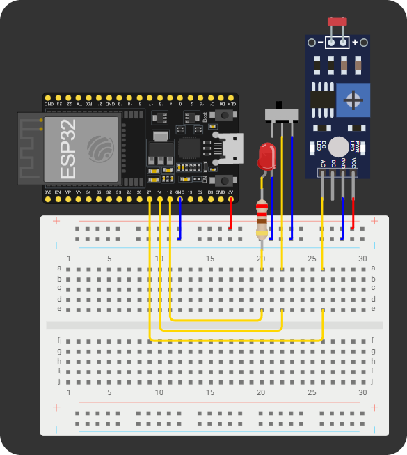

# Iluminação Inteligente com ESP32 + Spring Boot

Sistema de iluminação automática em tempo real com hardware simulado (Wokwi), backend Java e painel web.

## Circuito no Wokwi

<div align="center">
  
</div>

> 📸 _Print do circuito montado no Wokwi_

## Como funciona

```
Slide Switch (ESP32)
      ↓
  POST /api/interruptor
      ↓
Sensor LDR (ESP32) → POST /api/sensor
      ↓
  Spring Boot (Java)
      ↓
  LightingResponse { mode, luminosity, ledOn, switchOn, threshold }
      ↓
  Frontend HTML (polling a cada 3s)
```

- **Interruptor ON + Modo Automático** → sensor LDR decide (escuro = LED liga, claro = LED desliga)
- **Interruptor ON + Modo Manual** → LED sempre ligado (controle como lâmpada comum)
- **Interruptor OFF** → sistema desligado, LED apagado independente do modo

## Estrutura do projeto

```
lighting/
├── arduino/
│   ├── Diagram.json
│   └── Sketch.ino
├── docs/
│   └── Diagram.png
├── src/main/
│   ├── java/io/github/lighting/
│   │   ├── config/
│   │   │   └── DataInitializer.java
│   │   ├── controller/
│   │   │   ├── LightingController.java
│   │   │   └── ViewController.java
│   │   ├── domain/
│   │   │   └── Lighting.java
│   │   ├── dto/
│   │   │   ├── request/
│   │   │   │   ├── ModeRequest.java
│   │   │   │   ├── SensorRequest.java
│   │   │   │   ├── SwitchRequest.java
│   │   │   │   └── ThresholdRequest.java
│   │   │   └── response/
│   │   │       └── LightingResponse.java
│   │   ├── enums/
│   │   │   └── Mode.java
│   │   ├── exception/
│   │   │   ├── ErrorResponse.java
│   │   │   ├── GlobalExceptionHandler.java
│   │   │   └── LightingNotFoundException.java
│   │   ├── mapper/
│   │   │   └── LightingMapper.java
│   │   ├── repository/
│   │   │   └── LightingRepository.java
│   │   ├── service/
│   │   │   └── LightingService.java
│   │   └── LightingApplication.java
│   └── resources/
│       ├── static/
│       │   ├── css/
│       │   │   └── style.css
│       │   └── js/
│       │       └── app.js
│       ├── templates/
│       │   └── index.html
│       └── application.properties
├── .gitignore
├── mvnw
└── README.md
```

## Pré-requisitos

- Java 21+
- Maven
- Cloudflared instalado
- Conta no Wokwi (para simulação)

## Como executar

### 1. Iniciar o Spring Boot

```bash
./mvnw spring-boot:run
```

O servidor sobe em `http://localhost:8080`.

### 2. Expor o backend com Cloudflared

Abra um segundo terminal e rode:

```bash
cloudflared tunnel --url http://localhost:8080
```

O Cloudflared vai exibir uma URL pública como:

```
https://exemplo-qualquer.trycloudflare.com
```

> ⚠️ Essa URL muda toda vez que você reinicia o Cloudflared. Atualize-a nos dois lugares abaixo.

### 3. Atualizar a URL no Wokwi

Abra `Arduino/sketch.ino` e substitua as constantes:

```cpp
const char* sensorUrl = "https://SUA-URL.trycloudflare.com/api/sensor";
const char* switchUrl = "https://SUA-URL.trycloudflare.com/api/interruptor";
```

> A rede `Wokwi-GUEST` já está configurada — não é necessário alterar SSID ou senha.

### 4. Abrir o painel web

Acesse no navegador:

```
http://localhost:8080
```

O painel atualiza automaticamente a cada 3 segundos.

## Endpoints da API

| Método | Endpoint           | Descrição                              |
|--------|--------------------|----------------------------------------|
| GET    | /api/estado        | Retorna o estado atual do sistema      |
| POST   | /api/sensor        | Recebe leitura de luminosidade do LDR  |
| PATCH  | /api/interruptor   | Liga ou desliga o sistema              |
| PATCH  | /api/modo          | Altera o modo (AUTOMATIC ou MANUAL)    |
| PATCH  | /api/threshold     | Atualiza o valor limite de luminosidade|

Todas as respostas seguem o formato:

```json
{
  "id": 1,
  "mode": "AUTOMATIC",
  "luminosity": 342,
  "ledOn": true,
  "switchOn": true,
  "threshold": 500
}
```

## Pinagem do ESP32

| Pino   | Função                        |
|--------|-------------------------------|
| GPIO34 | LDR (sensor de luminosidade)  |
| GPIO5  | LED                           |
| GPIO15 | Slide Switch (interruptor)    |

## Tecnologias

- **Backend:** Java 21, Spring Boot 3, Spring Data JPA, H2, Lombok, Validation
- **Frontend:** HTML, CSS, JavaScript (vanilla), Thymeleaf
- **Hardware:** ESP32, Wokwi
- **Túnel:** Cloudflare Tunnel (trycloudflare.com)
